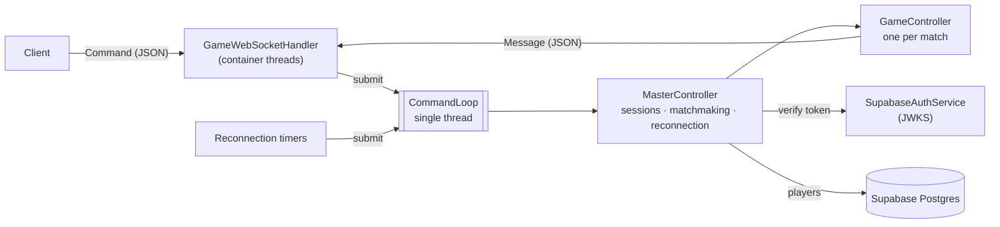

# Ascensore — Game Server

Authoritative multiplayer server for **Ascensore**, a traditional Italian trick-taking card game, built with
**Java 17 / Spring Boot** and **WebSockets**. The Flutter client lives in
[Ascensore_Card_Game](https://github.com/AndreaSacconi7/Ascensore_Card_Game).

## The game

Played with the 40-card Italian deck by 2–4 players. The hand size goes **up from 1 to 10 cards and back down
to 1** — like an elevator (*ascensore*), 19 sets in total. At the start of every set each player bets exactly
how many tricks they will take; the last player to bet cannot make the bets add up to the number of tricks,
so someone always misses. An exact bet scores 10 plus 10 per trick; a missed bet loses 10 per trick of
difference.

## Architecture



**One thread owns all game state.** WebSocket callbacks run on the servlet container's threads, but they only
parse the command and queue it on the `CommandLoop`, a single-threaded executor. Closed connections and
expired reconnection timers are queued the same way. Every change to lobby, matches and sessions therefore
happens on one thread, in arrival order, with no locks in the game logic, and a command that throws is
logged and skipped instead of stopping the loop.

**The server is authoritative.** Clients send intentions (`SET_BET`, `PUT_CARD`); the server checks turn,
hand and rules (`GameRules`, pure functions) and broadcasts the result. A player is identified by the socket
the command arrived on, never by a field in the payload.

**Authentication** is delegated to Supabase Auth. The client sends its access token as the first command;
the server verifies the ES256 signature against the project's public keys (fetched from its JWKS endpoint,
refetched on key rotation) and takes the player id from the token.

**Reconnection.** If a socket drops mid-match the seat is kept for 60 seconds. The player's next
`PLAYER_INFO_REQUEST` on a new socket cancels the timer and replays the table state. Races are handled
explicitly: a timer that fires just as the player returns is ignored, and the old socket reporting its close
after the new one connected does not start a new timer.

The wire format is documented in [docs/protocol.md](docs/protocol.md).

## Project structure

```
src/main/java/polimi/ascensore/
├── controller/          CommandLoop, MasterController, GameController, GameSettings, NicknamePolicy
├── model/               Game, GameRules, Deck, Card, GamePlayer, TableCard
├── network/
│   ├── websocket/       GameWebSocketHandler, CommandDispatcher, CommandDeserializer, WebSocketConfig
│   ├── command/         client → server commands
│   └── message/         server → client messages
├── auth/                SupabaseAuthService
└── persistence/         Player entity and repository
```

## Running

Requires Java 17+ and a Supabase project (Auth + Postgres).

| Variable | Value |
|---|---|
| `SUPABASE_JWT_URL` | `https://<project>.supabase.co/auth/v1/.well-known/jwks.json` |
| `SUPABASE_DB_URL` | JDBC URL of the database, e.g. `jdbc:postgresql://<host>:5432/postgres`. The direct host is IPv6-only; on IPv4-only hosts use the connection pooler URL. |
| `SUPABASE_DB_USER` | Database user (default `postgres`) |
| `SUPABASE_DB_PASSWORD` | Database password |
| `PLAYERS_PER_MATCH` | 2–4 (default 2) |
| `MAX_HAND_SIZE` | Largest hand (default 10); lower it for quick test matches |
| `PORT` | HTTP port (default 8080) |

```bash
./mvnw spring-boot:run
```

The WebSocket endpoint is `ws://localhost:8080/ws` (use `wss://` behind TLS in production).

## Tests

```bash
./mvnw test
```

- `GameRulesTest`, `DeckTest` — rules and deck as pure functions
- `GameControllerTest` — plays complete 2-, 3- and 4-player matches with valid moves and checks every set,
  trick and the final standing; out-of-turn and invalid moves are rejected
- `MasterControllerTest` — login, nicknames, matchmaking, disconnection and reconnection windows
- `CommandLoopTest`, `GameWebSocketHandlerTest` — the loop survives failing commands, broadcasts survive
  dead sessions
- `GameServerIntegrationTest` — the real server over WebSockets with signed tokens: nickname choice, a match
  start, a dropped connection and the reconnection

## Known limitations

- **One instance.** Match state lives in memory on the command loop, so the server runs as a single
  instance; scaling out would need matches pinned to instances.
- **One loop for all matches.** Simple and race-free; a slow database call (login) delays every match by
  its duration. Per-match loops are the next step if load grows.
- **A player who leaves ends the match** for everyone instead of the match continuing without them.
