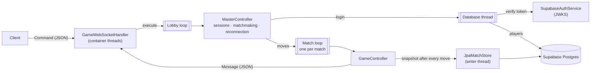

# Ascensore — Game Server

Authoritative multiplayer server for **Ascensore**, a traditional Italian trick-taking card game, built with
**Java 17 / Spring Boot** and **WebSockets**. The Flutter client lives in
[Ascensore_Card_Game](https://github.com/AndreaSacconi7/Ascensore_Card_Game).

## The game

Played with the 40-card Italian deck by 2–4 players; each player picks the match size and matchmaking keeps a queue per size. The hand size goes **up from 1 to 10 cards and back down
to 1** — like an elevator (*ascensore*), 19 sets in total. At the start of every set each player bets exactly
how many tricks they will take; the last player to bet cannot make the bets add up to the number of tricks,
so someone always misses. An exact bet scores 10 plus 10 per trick; a missed bet loses 10 per trick of
difference.

## Architecture



**Each piece of state has one owner.** WebSocket callbacks run on the servlet container's threads, but they
only parse the command and queue it on the **lobby loop**, which owns sessions, matchmaking and the map of
who plays where. A started match has its own **match loop**: moves, turn deadlines and reconnections of that
match run there, one at a time and in arrival order, so the game logic needs no locks. Loops are serial
executors over a shared thread pool (`SerialLoop`): matches run in parallel and a busy one never delays the
others. The blocking part of a login (token check, database lookup, nickname claim) runs on a separate
**database thread** and completes back on the lobby, so no loop waits on the network. A task that throws is
logged and skipped instead of stopping its loop.

**Matches survive restarts.** After every move the match hands an immutable snapshot (`MatchState`) to the
`JpaMatchStore`, which writes it to Postgres in the background, coalescing bursts and retrying if the
database is briefly unreachable; the row is deleted when the match ends. At startup, before accepting
connections, the server restores the saved matches: players find their seat when their client reconnects,
and the player on turn gets 20 extra seconds. A deploy (clean stop) loses nothing; a crash loses at most the
moves of the last few milliseconds, and the reconnection replays the restored table. Tables are protected
with Row Level Security at startup, since Supabase would otherwise expose them (hands included) through its
REST API.

**The server is authoritative.** Clients send intentions (`SET_BET`, `PUT_CARD`); the server checks turn,
hand and rules (`GameRules`, pure functions) and broadcasts the result. A player is identified by the socket
the command arrived on, never by a field in the payload.

**Authentication** is delegated to Supabase Auth. The client sends its access token as the first command;
the server verifies the ES256 signature against the project's public keys (fetched from its JWKS endpoint,
refetched on key rotation) and takes the player id from the token.

**Reconnection.** If a socket drops mid-match the seat is kept for 60 seconds. The player's next
`PLAYER_INFO_REQUEST` on a new socket cancels the timer and replays the table state. Races are handled
explicitly: a timer that fires just as the player returns is ignored, and the old socket reporting its close
after the new one connected does not start a new timer.

**Turn deadlines and liveness.** Every turn has a deadline that fires on the match's loop: when it
runs out the server bets or plays for the player, and three timeouts in a row take them out of the match.
Clients send a heartbeat every few seconds, so a connection that died silently is closed within 30 s and
the reconnection window starts; outgoing messages are buffered per session so a slow client cannot block
the loop. One account plays on one device at a time: logging in elsewhere closes the older session.

The wire format is documented in [docs/protocol.md](docs/protocol.md).

## Project structure

```
src/main/java/polimi/ascensore/
├── controller/          GameLoops, SerialLoop, MasterController, GameController, MatchStore, ServerStartup
├── model/               Game, GameRules, Deck, Card, GamePlayer, TableCard, MatchState
├── network/
│   ├── websocket/       GameWebSocketHandler, CommandDispatcher, CommandDeserializer, WebSocketConfig
│   ├── http/            health check
│   ├── command/         client → server commands
│   └── message/         server → client messages
├── auth/                SupabaseAuthService
└── persistence/         Player, match snapshots (JpaMatchStore), Row Level Security setup
```

## Running

Requires Java 17+ and a Supabase project (Auth + Postgres).

| Variable | Value |
|---|---|
| `SUPABASE_JWT_URL` | `https://<project>.supabase.co/auth/v1/.well-known/jwks.json` |
| `SUPABASE_DB_URL` | JDBC URL of the database, e.g. `jdbc:postgresql://<host>:5432/postgres`. The direct host is IPv6-only; on IPv4-only hosts use the connection pooler URL. |
| `SUPABASE_DB_USER` | Database user (default `postgres`) |
| `SUPABASE_DB_PASSWORD` | Database password |
| `PLAYERS_PER_MATCH` | Match size for clients that do not choose one (default 2) |
| `MAX_HAND_SIZE` | Largest hand (default 10); lower it for quick test matches |
| `TURN_SECONDS` | Time to bet or play before the server acts for the player (default 30, 0 = no limit) |
| `PORT` | HTTP port (default 8080) |

Saved matches older than two hours are discarded at startup (`ascensore.snapshot-max-age-minutes`).

```bash
./mvnw spring-boot:run
```

The WebSocket endpoint is `ws://localhost:8080/ws` (use `wss://` behind TLS in production); `GET /health`
answers `ok` for the hosting platform's checks.

### Deploying to Fly.io

The `Dockerfile` builds the jar and runs it on a JRE; `fly.toml` keeps one machine always on (a match lives
on one server) and checks `/health`. With [flyctl](https://fly.io/docs/flyctl/) logged in:

```bash
fly launch --no-deploy --copy-config
fly secrets set SUPABASE_JWT_URL=... SUPABASE_DB_URL=... SUPABASE_DB_USER=... SUPABASE_DB_PASSWORD=...
fly deploy
```

Clients then connect to `wss://<app>.fly.dev/ws`. A deploy stops the old machine and starts the new one;
matches in progress are restored and players reconnect on their own.

## Tests

```bash
./mvnw test
```

- `GameRulesTest`, `DeckTest` — rules and deck as pure functions
- `GameControllerTest` — plays complete 2-, 3- and 4-player matches with valid moves and checks every set,
  trick and the final standing; out-of-turn and invalid moves are rejected
- `GameControllerTest` also saves random matches mid-play, restores them through JSON and plays them to
  the end
- `MasterControllerTest` — login, nicknames, matchmaking, disconnection and reconnection windows, and a
  restart: players find their restored match
- `SerialLoopTest` — order, one task at a time, a failing task does not stop the loop, a blocked match does
  not hold up the others
- `JpaMatchStoreTest` — snapshots on the real schema: latest state wins, ended matches go, stale ones are
  discarded
- `GameWebSocketHandlerTest` — broadcasts survive dead sessions, heartbeat, flood protection
- `GameServerIntegrationTest` — the real server over WebSockets with signed tokens: nickname choice, a match
  start, a dropped connection and the reconnection

## Known limitations

- **One instance.** Matches run in the memory of one server (and survive its restarts through the
  snapshots). Scaling out would need each match pinned to an instance, with players routed to it.
- **Downtime during a deploy.** With a single machine, players are disconnected for the few seconds the new
  one takes to start; their clients reconnect and the match resumes.
